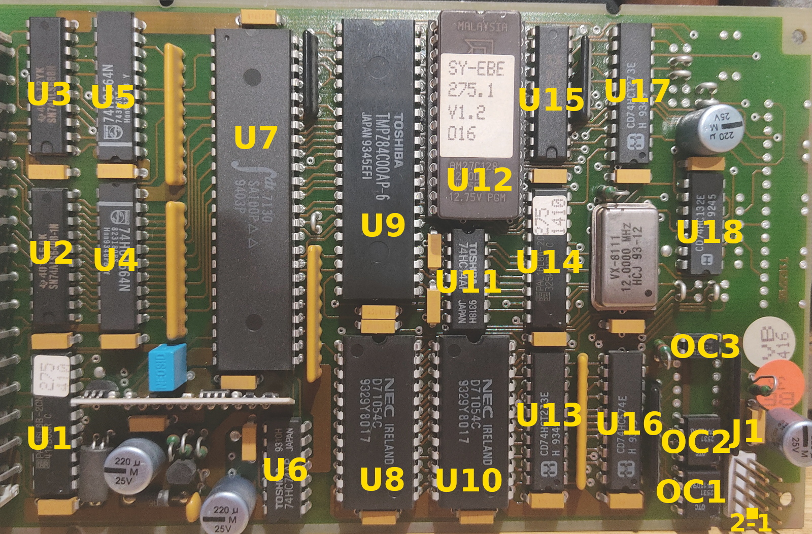
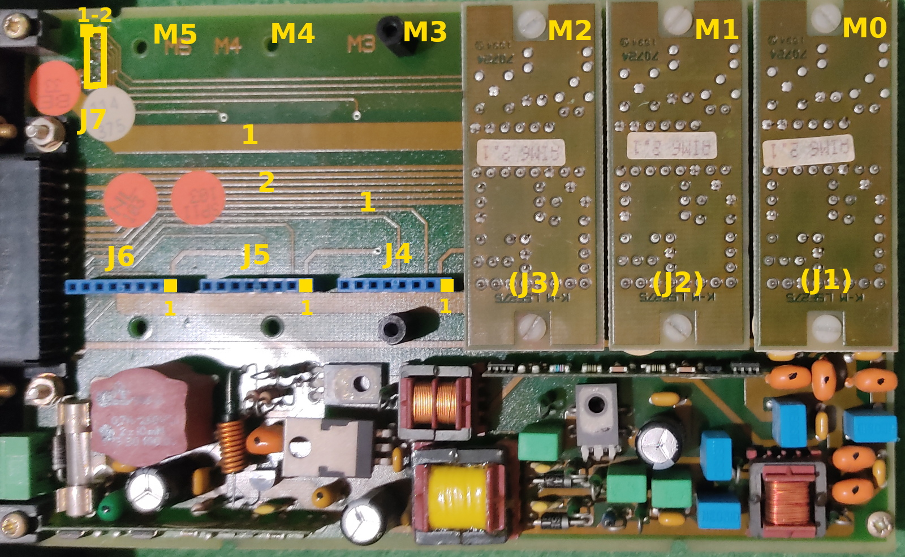

# External interface box

## EBE 275.2 analog input module

> [!NOTE]
> This document is an independent, reverse-engineered description of this module
> It is not affiliated with, endorsed by, or derived from official manufacturer
> documentation.

### About module

_There are no position numbers or other markings printed on the panel._  

(..)

### Integrated circuits important for control

#### Digital board

|Own sign|Type    |Function                   |Work                      |Note       |
|:------:|:------:|---------------------------|--------------------------|-----------|
|        |        |                           |                          |           |

(..)

#### Analog board

(..)

### Jumper settings

(..)

### Connection with bus

|Pin|Function            |card-CPU|Own sign|Note                |
|--:|--------------------|:------:|:------:|--------------------|
|   |                    |        |        |                    |

### Softwares

(..)
