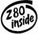

 

# Zacchaeus Microcomputer

**8-bit microcomputer built from commercially available and home-built components** 
  
This project is a personal journey back in time to the heroic age of computing:
a newly built, classic 8-bit system, in which I supplement the factory components
with modules of my own design. My goal is to revive the joy of discovery, while
on this new machine, legendary languages ​such as BASIC, Fortran or Cobol come to
life again.

 

## Features

|components   |type, size, etc.                             |
|-------------|---------------------------------------------|
|motherboard  |SC126 (Stephen C. Cousins)                   |
|firmware     |RomWBW SCZ180_sc126 v3.5.1 2025-05-21        |
|processor    |Z180 processor (33 MHz - at 18.432 MHz)      | 
|ROM          |2 x 512 kB byte Flash memory                 |
|RAM          |1 x 512 kB byte RAM                          |
|bus          |RC2014, 9 BP80 socket                        |
|disks        |32 MB CF card                                |
|             |SD card                                      |
|others       |RTC                                          |
|             |MPU (manual programming unit)                |
|             |- 8 data and 16 address switch               |
|             |- 8 digits hexadecimal LED display           |
|             |(partly implemented)                         |
|connectors   |2 x serial RS-232                            |
|             |2 x serial RS-232 TTL                        |
|             |2 x paralel TTL                              |
|             |1 x CTC TTL                                  |
|             |1 x I2C TTL                       |
|             |1 x SPI TTL                                  |
|             |1 x cassette (not yet implemented)           | 
|             |1 x earphone (not yet implemented)           |
|             |4 x protected digital input 12V              |
|             |4 x open collector output                    |
|             |4 x NO/NC relay contact output               |
|             |2 x analog input 0-10V (not yet implemented) | 
|             |2 x analog output 0-10V (not yet implemented)| 
|power outputs|+12/5/3.3V 3A                                |
|             |-12/5V 0,5A                                  |
|power supply |ATX 600W                                     |
|OS           |Digital Research CP/M v2.2                   |
|             |Z-System                                     |

## Internal structure

The machine is housed in a power supply unit (OMSZÖV OE-222) from the 1980s.
The computer consists of the following components:

|name   |function                                     |
|-------|---------------------------------------------|
|SC126  |motherboard (Stephen C. Cousins)             |
|SC702  |RCBus backplane (Stephen C. Cousins)         |
|SC715  |RCBus CF module (Stephen C. Cousins)         |
|SC716  |RCBus SIO-2 module (Stephen C. Cousins)      |
|SC717  |RCBus PIO module (Stephen C. Cousins)        |
|SC718  |RCBus CTC module (Stephen C. Cousins)        |
|SC719  |RCBus DIO module (Stephen C. Cousins)        |
|PIOI   |I/O interface module                         |
|PMAN-DP|Display module                               |
|PMAN-SW|Switch module                                |
|PPOW   |Power distribution module with external fuses|
|PSPK   |Speaker amplifier module with speaker        |
|       |2 x TTL/RS232 level shifter module           |
|       |ATX PC power supply                          |

### Planned modules

|name   |function                                                      |
|-------|--------------------------------------------------------------|
|PANA   |Two channels analog input-output module (0-10V)               |
|PCAS   |Cassette interface module                                     |
|PCOX   |Internal COVOX-style mono sound module with earphone amplifier|
|PMAN-IF|Manual programming interface module                           |
