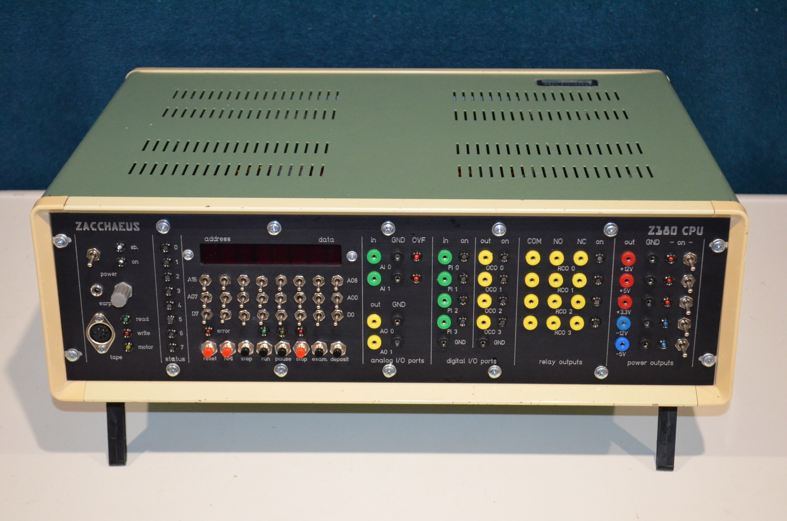

 

# Zacchaeus Microcomputer
**8-bit microcomputer built from commercially available and home-built components** 

> [!NOTE]
> Content will be updated continuously as development progresses.

This project is a personal journey back in time to the heroic age of computing:
a newly built, classic 8-bit system, in which I supplement the factory components
with modules of my own design. My goal is to revive the joy of discovery, while
on this new machine, legendary languages ​such as BASIC, Fortran or Cobol come to
life again.

 &nbsp;

The computer is built on a motherboard based on the Z180 processor and expansion
cards designed by Stephen C. Cousins. These component descriptions are provided
for completeness and represent the versions available at the time of use.
For more detailed descriptions and the latest updates, please visit the original
author's website ([Small Computer Central](https://smallcomputercentral.com/)).
These components are licensed as _open source_ and _public domain_. 

These components are complemented by custom-designed expansion cards and
external peripherals. These components are licensed as _public domain_.

A detailed description of the computer can be found in the
[Zacchaeus computer](https://github.com/pozsarzs/zacchaeus/tree/main/Zacchaeus%20computer) folder. 

## External interface box

> [!NOTE]
> Content will be updated continuously as development progresses.

PEIX is an 8-slot interface connecting legacy _Klöckner-Moeller PS316_ I/O modules
to the Zacchaeus computer. It restores functionality to these obsolete analog
and digital modules.

A detailed description of the interface box can be found in the [PEIX External
interface box](https://github.com/pozsarzs/zacchaeus/tree/main/PEIX%20External%20interface%20box) folder. 

## External memory box (EPROM bank)

> [!NOTE]
> Content will be updated continuously as development progresses.

PEMX is an 8-slot external EPROM bank connected via two PIO ports. It supports
2764 through 27512 EPROMs, including 'A' and CMOS variants.

A detailed description of the memory box can be found in the [PEMX External
memory box](https://github.com/pozsarzs/zacchaeus/tree/main/PEMX%20External%20memory%20box) folder. 

### My related projects on Github

- [An extended Turing machine implementation for CP/M and DOS](https://github.com/pozsarzs/alanz80x)
- [Turing machine implementation for CP/M and DOS](https://github.com/pozsarzs/alanz80)
- [Simulator for running DATAS machine code for CP/M and DOS](https://github.com/pozsarzs/datassim)
- [The FORTRAN Month](https://github.com/pozsarzs/fortran_month)
