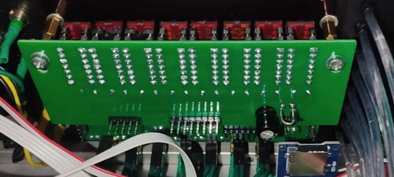

# Zacchaeus Microcomputer

## Hardware/PMAN-DP Display module

### Directory content

|file                    |description                   |
|------------------------|------------------------------|
|\[pman-dp\]             |KiCAD files                   |
|pman-dp-B_Cu.pdf        |solder side of the PCB        |
|pman-dp-F_Cu.pdf        |component side of the PCB     |
|pman-dp-F_Silkscreen.pdf|silkscreen of the PCB         |
|pman-dp-gerber.zip      |Gerber files for manufacturing|
|pman-dp.pdf             |schematic drawing             |

### About module

The PMAN-DP module is the component of the Manual control panel, which
contains eight hexadecimal LED displays connected in a matrix. The module
has four selection lines and 8-bit data input, to which the displays are
connected in pairs. The blanking input of the displays is common. The module
requires +5V DC to operate.

#### The installed module

  

### Jumper settings

There is no jumper setting option on the module.

### Connection with others

This component is connected to the computer bus by the PMAN-IF interface module.

|Module |Num  |Sign|Function                 |Sign|Num |Module |
|-------|:---:|----|-------------------------|----|:--:|-------|
|PMAN-IF|     |+5V |+5V                      |+5V |J1/1|PMAN-DP|
|PMAN-IF|     |GND |GND                      |GND |J1/2|PMAN-DP|
|PMAN-IF|     | S0 |DIS1/5 selection         | S0 |J2/1|PMAN-DP|
|PMAN-IF|     | S1 |DIS2/6 selection         | S1 |J2/2|PMAN-DP|
|PMAN-IF|     | S2 |DIS3/7 selection         | S2 |J2/3|PMAN-DP|
|PMAN-IF|     | S3 |DIS4/8 selection         | S3 |J2/4|PMAN-DP|
|PMAN-IF|     | BL |DIS1-8 blank             | BL |J2/5|PMAN-DP|
|PMAN-IF|     | D0 |DIS1-4 data input A      | D0 |J3/1|PMAN-DP|				Adata inputJ3jpDIS1-8 blank             |BL  |J2/5|PMAN-DP|
|PMAN-IF|     | D1 |DIS1-4 data input B      | D1 |J3/1|PMAN-DP|				Adata inputJ3jpDIS1-8 blank             |BL  |J2/5|PMAN-DP|
|PMAN-IF|     | D2 |DIS1-4 data input C      | D2 |J3/1|PMAN-DP|				Adata inputJ3jpDIS1-8 blank             |BL  |J2/5|PMAN-DP|
|PMAN-IF|     | D3 |DIS1-4 data input D      | D3 |J3/1|PMAN-DP|				Adata inputJ3jpDIS1-8 blank             |BL  |J2/5|PMAN-DP|
|PMAN-IF|     | D4 |DIS5-8 data input A      | D4 |J3/1|PMAN-DP|				Adata inputJ3jpDIS1-8 blank             |BL  |J2/5|PMAN-DP|
|PMAN-IF|     | D5 |DIS5-8 data input B      | D5 |J3/1|PMAN-DP|				Adata inputJ3jpDIS1-8 blank             |BL  |J2/5|PMAN-DP|
|PMAN-IF|     | D6 |DIS5-8 data input C      | D6 |J3/1|PMAN-DP|				Adata inputJ3jpDIS1-8 blank             |BL  |J2/5|PMAN-DP|
|PMAN-IF|     | D7 |DIS1-4 data input D      | D7 |J3/1|PMAN-DP|				Adata inputJ3jpDIS1-8 blank             |BL  |J2/5|PMAN-DP|
