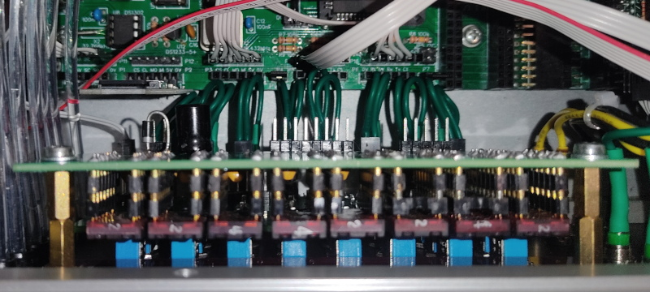
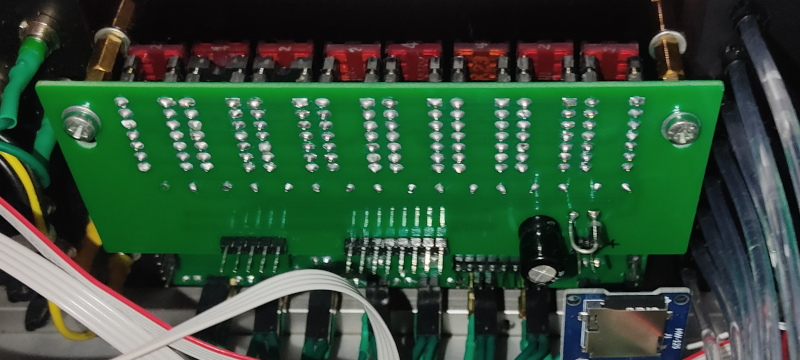

# Zacchaeus Microcomputer

## Hardware/PMAN-DP Display module

### Directory content

|file                    |description                   |
|------------------------|------------------------------|
|\[pman-dp\]             |KiCAD files                   |
|pman-dp-B_Cu.pdf        |solder side of the PCB        |
|pman-dp-F_Cu.pdf        |component side of the PCB     |
|pman-dp-F_Silkscreen.pdf|silkscreen of the PCB         |
|pman-dp-gerber.zip      |Gerber files for manufacturing|
|pman-dp-?.pdf           |installed module              |
|pman-dp.pdf             |schematic drawing             |

### About module

The PMAN-DP module is the component of the Manual control panel, which
contains eight hexadecimal LED displays connected in a matrix. The module
has four selection lines and 8-bit data input, to which the displays are
connected in pairs. The blanking input of the displays is common. The module
requires +5V DC to operate.

#### The installed module

### Jumper settings

There is no jumper setting option on the module.

### Connection with others

This component is connected to the computer bus by the PMAN-IF interface module.
