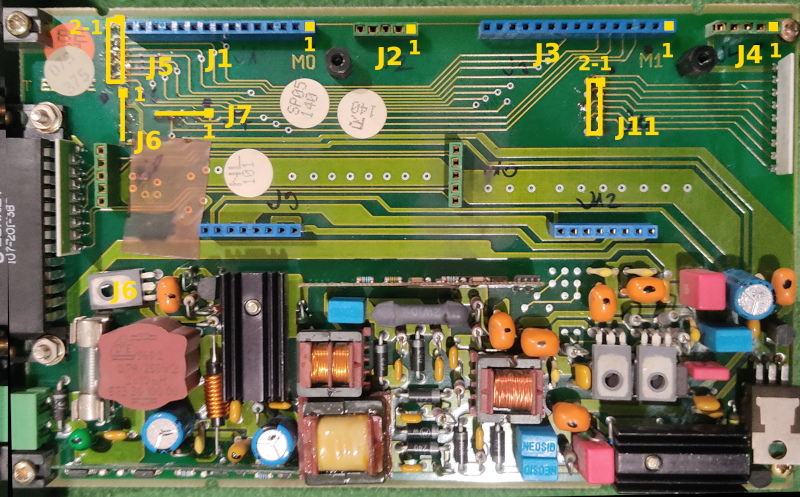

# Zacchaeus Microcomputer

## EBE 287.1 analog output module

> [!NOTE]
> This document is an independent, reverse-engineered description of this module
> It is not affiliated with, endorsed by, or derived from official manufacturer
> documentation.
>

### About module

_There are no position numbers or other markings printed on the panel._  

The module consists of two main parts: the analog and the digital panel.

The analog panel has two additional components that determine the type of
output signal. The tested model has two AQM61.2 types, which can produce
-10..+10V in 12-bit resolution.

The digital board is a circuit built from traditional TTL and PAL circuits
that controls the D/A converters on the analog board. The control of analog
I/O modules is completely different from that of digital ones.

(..)

The card uses internal +5V and external +24V power supply. 

### Integrated circuits important for control

#### Digital board

|Own sign|Type    |Function                   |Work                      |Note       |
|:------:|:------:|---------------------------|--------------------------|-----------|
|   U1   |74ALS245|bidirectional bus driver   |read sub-modules' jumpers |           |
|   U2   |74ALS245|bidirectional bus driver   |write address to storage  |           |
|   U3   |74ALS688|8-bit identity comparator  |card address comparison   |           |
|   U4   |PAL16L8 |programmable array logic   |unknown                   |2871 0310  | 
|   U5   |74LS273 |octal D-type Flip-flops    |card address storage      |           |
|   U6   |PAL16R8 |programmable array logic   |unknown                   |2871 1410  | 
|   U7   |PAL16R4 |programmable array logic   |unknown                   |2871 1310  | 
|   U8   |PAL16R6 |programmable array logic   |unknown                   |2871 1110  | 
|   U9   |74ALS244|octal bus line driver      |                          |           |

(..)

Schematic in pdf: [ebe_287-1-digital.pdf](ebe_287-1/ebe_287-1-digital.pdf)  

#### Analog board

(..)

Schematics in pdf:  

- [ebe_287-1-analog.pdf](ebe_287-1/ebe_287-1-analog.pdf)  
- [aqm61-2.pdf](aqm61-2/aqm61-2.pdf)  

### Jumper settings

(..)

### Connection with bus

|Pin|Function            |card-CPU|Own sign|Note                |
|--:|--------------------|:------:|:------:|--------------------|
| 2a|GND                 |        |        |                    |
| 4a|+5V                 |        |        |                    |
| 6a|N.C.                |        |        |                    |
| 8a|N.C.                |        |        |                    |
|10a|/RST                |  <---  |  /RST  |                    |
|12a|N.C.                |        |        |                    |
|14a|N.C.                |        |        |                    |
|16a|N.C.                |        |        |                    |
|18a|N.C.                |        |        |                    |
|20a|N.C.                |        |        |                    |
|22a|N.C.                |        |        |                    |
|24a|N.C.                |        |        |                    |
|26a|N.C.                |        |        |                    |
|28a|N.C.                |        |        |                    |
|30a|N.C.                |        |        |                    |
|32a|N.C.                |        |        |                    |
| 2b|N.C.                |        |        |                    |
| 4b|N.C.                |        |        |                    |
| 6b|N.C.                |        |        |                    |
| 8b|N.C.                |        |        |                    |
|10b|unknown             |  <---  |        |                    |
|12b|unknown             |  --->  |        |                    |
|14b|unknown             |  <---  |        |                    |
|16b|N.C.                |  <---  |        |                    |
|18b|data 0              |  <---  |  D0    |                    |
|20b|data 2              |  <---  |  D2    |                    |
|22b|data 4              |  <---  |  D4    |                    |
|24b|data 6              |  <---  |  D6    |                    |
|26b|card address line   |  <---  |  DA0   |                    |
|28b|card address line   |  <---  |  DA2   |                    |
|30b|card address line   |  <---  |  DA4   |                    |
|32b|card address line   |  <---  |  DA6   |                    |
| 2z|N.C.                |        |        |                    |
| 4z|N.C.                |        |        |                    |
| 6z|N.C.                |        |        |                    |
| 8z|N.C.                |        |        |                    |
|10z|unknown             |  <---  |        |                    |
|12z|unknown             |  <---  |        |                    |
|14z|GND                 |        |        |                    |
|16z|unknown             |  <---  |        |                    |
|18z|data line           |  <---  |  D1    |                    |
|20z|data line           |  <---  |  D3    |                    |
|22z|data line           |  <---  |  D5    |                    |
|24z|data line           |  <---  |  D7    |                    |
|26z|card address line   |  <---  |  DA1   |                    |
|28z|card address line   |  <---  |  DA3   |                    |
|30z|card address line   |  <---  |  DA5   |                    |
|32z|card address line   |  <---  |  DA7   |                    |

### Softwares

This module does not have its own software. Its operation was ensured by the
CPU module of the original system.
