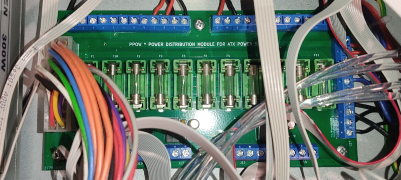

# Zacchaeus Microcomputer

## Hardware/PPOW Power distribution module 

### Directory content

|file                 |description                   |
|---------------------|------------------------------|
|\[ppow\]             |KiCAD files                   |
|ppow-B_Cu.pdf        |solder side of the PCB        |
|ppow-F_Cu.pdf        |component side of the PCB     |
|ppow-F_Silkscreen.pdf|silkscreen of the PCB         |
|ppow-gerber.zip      |Gerber files for manufacturing|
|ppow.pdf             |schematic drawing             |

### About module

The PPOW module is responsible for distributing the power voltages coming from
the ATX PC power supply. The module has two +12V, three +5V and 3.3V, one -5V,
-12V and standby +5V outputs. These outputs are protected by fuses and double
terminal blocks. These are used to power the internal units. Additionally, there
are five unprotected outputs that are connected to the front panel power outputs
using back panel fuses. The module also has two 24V/41 mA ground-independent
auxiliary power outputs, power switch and LED connectors.

#### The installed module

### Jumper settings

There is no jumper setting option on the module.

### Connection with others

Pinout of connectors and terminal blocks:

|Module|Num    |Sign |Function                  |Sign|Num |Module |
|------|:-----:|-----|--------------------------|----|:--:|-------|
|PPOW  |J1/1   |GND  |GND                       |    |    |       |
|PPOW  |J1/2   |PSON |STAND-BY/ON switch        |    |    |       |
|PPOW  |J2     |ATX  |ATX power supply connector|    |    |       |
|PPOW  |J3/1   |PLED |POWER ON LED anode        |    |    |       |
|PPOW  |J3/2   |GND  |POWER ON LED cathode      |    |    |       |
|PPOW  |J3/3   |SBLED|STAND-BY LED anode        |    |    |       |
|PPOW  |J3/4   |GND  |STAND-BY LED cathode      |    |    |       |
|PPOW  |J4/1-2 |+12V |power voltage output      |    |    |       |
|PPOW  |J5/1-2 |GND  |GND                       |    |    |       |
|PPOW  |J6/1-2 |+12V |power voltage output      |    |    |       |
|PPOW  |J7/1-2 |GND  |GND                       |    |    |       |
|PPOW  |J8/1-2 |+5V  |power voltage output      |    |    |       |
|PPOW  |J9/1-2 |GND  |GND                       |    |    |       |
|PPOW  |J10/1-2|+5V  |power voltage output      |    |    |       |
|PPOW  |J11/1-2|GND  |GND                       |    |    |       |
|PPOW  |J12/1-2|+5V  |power voltage output      |    |    |       |
|PPOW  |J13/1-2|GND  |GND                       |    |    |       |
|PPOW  |J14/1-2|+3.3V|power voltage output      |    |    |       |
|PPOW  |J15/1-2|GND  |GND                       |    |    |       |
|PPOW  |J16/1-2|+3.3V|power voltage output      |    |    |       |
|PPOW  |J17/1-2|GND  |GND                       |    |    |       |
|PPOW  |J18/1-2|+3.3V|power voltage output      |    |    |       |
|PPOW  |J19/1-2|GND  |GND                       |    |    |       |
|PPOW  |J20/1-2|-5V  |power voltage output      |    |    |       |
|PPOW  |J21/1-2|GND  |GND                       |    |    |       |
|PPOW  |J22/1-2|-12V |power voltage output      |    |    |       |
|PPOW  |J23/1-2|GND  |GND                       |    |    |       |
|PPOW  |J24/1-2|+5VSB|auxiliary voltage output  |    |    |       |
|PPOW  |J25/1-2|GND  |GND                       |    |    |       |
|PPOW  |J26/1  |+12V |unprotected power output  |    |    |       |
|PPOW  |J26/2  |+5V  |unprotected power output  |    |    |       |
|PPOW  |J26/3  |+3.3V|unprotected power output  |    |    |       |
|PPOW  |J26/4  |-5V  |unprotected power output  |    |    |       |
|PPOW  |J26/5  |-12V |unprotected power output  |    |    |       |
|PPOW  |J27/1-5|GND  |GND                       |    |    |       |
|PPOW  |J28/1  |+24V |auxiliary voltage output  |    |    |       |
|PPOW  |J28/2  |-24V |auxiliary voltage output  |    |    |       |
|PPOW  |J28/3  |N.C. |                          |    |    |       |
|PPOW  |J29/1  |+24V |auxiliary voltage output  |    |    |       |
|PPOW  |J29/2  |-24V |auxiliary voltage output  |    |    |       |
|PPOW  |J29/3  |N.C. |                          |    |    |       |

### Softwares

The power distribution module does not have its own software.
