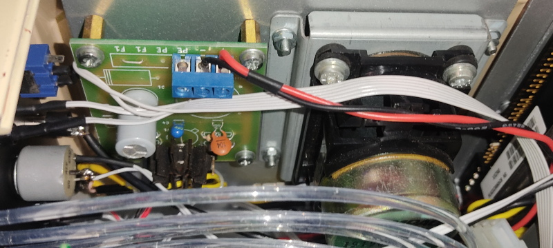

# Zacchaeus Microcomputer

## Hardware/PSPK Speaker amplifier module

### Directory content

|file                 |description                   |
|---------------------|------------------------------|
|\[pspk\]             |KiCAD files                   |
|pspk-B_Cu.pdf        |solder side of the PCB        |
|pspk-F_Silkscreen.pdf|silkscreen of the PCB         |
|pspk-gerber.zip      |Gerber files for manufacturing|
|pspk.pdf             |schematic drawing             |

### About module

The PSPK is a combined power voltage input and simple speaker amplifier module
originally built for another device. Unused ones do not need to be installed.
The module requires +5V DC to operate.

#### The installed module

### Jumper settings

There is no jumper setting option on the module.

### Connection with others

|Module|Num |Sign|Function               |Sign|Num |Module |
|------|:--:|----|-----------------------|----|:--:|-------|
|PPOW  |    |GND |GND                    |GND |J2/1|PSPK   |
|PPOW  |    |+5V |+5V power voltage input|+5V |J2/3|PSPK   |
|      |    |    |TTL level input        |    |J3/1|PSPK   |
|      |    |    |GND                    |GND |J3/2|PSPK   |
|PSPK  |J5/1|    |speaker +              | +  |    |speaker|
|PSPK  |J5/2|    |speaker -              | -  |    |speaker|

### Softwares

This module does not have its own software.
